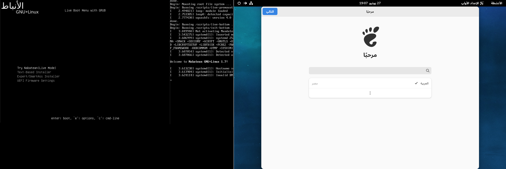

تشتهر أنظمة لينكس بقابليتها للتعديل ومرونتها وفقًا لاحتياجات المستخدم، وتعتبر الأصناف المختلفة من لينكس (والمعروفة باسم «التوزيعات») أكثر ما يميزه، حيث هناك عدد قد يبدو لا نهائي منها، فكيف كانت لمسة الوطن العربي في هذا الوسط؟

تسابقت توزيعات لينكس على مر السنين إلا أن توزيعات مثل "Ubuntu" أو "Fedora" جذبت الاهتمام أكثر من قريناتها وصارت تعمل كأساس لبناء توزيعات أخرى، تستمد تطبيقاتها الأساسية من أحدى التوزعتين المذكورتين آنفًا ويُضاف للتوزيعة المستحدثة ما يتناسب مع الغاية الأساسية لها.
وإذًا، وبعدما تحدثنا عن التوزيعات عامةً، نعرج في حديثنا إلى الحضور العربي والإسلامي في المجال، وأشهر التوزيعات الموجهة خصيصًا للمستخدم العربي المسلم، بتطبيقات تيسر عليه التمسك بعقيدته وتجعل الأعمال الدينية جزءًا من روتينه.

## تاريخيًا
### حيدر لينكس
قد تكون توزيعة [«حيدر لينكس»](https://distrowatch.com/table-mobile.php?distribution=haydar) أول توزيعة بطابع عربي متاحة للعامة حيث تم نشر أول النسخ التجريبية من النظام والمبني على "Fedora" في 2002، ولكن للأسف كانت بالكاد ما تختلف عن نسخ "Fedora" الأصلية باستثناء دعم طفيف للغة العربية، وسرعان ما تم التخلي عن المشروع وتوقف الدعم عنه.

### سبيلي لينكس

 [«سبيلي لينكس»](https://distrowatch.com/table.php?distribution=sabily)، والتي صدرت في 2007 هي توزيعة مبنية على "Ubuntu" موجهة حصرًا وأساسًا للمجتمع العربي المسلم، وهي أولى التوزيعات التي أضافت الطابع الإسلامي لتوزيعات لينكس. وخلافًا عن «حيدر لينكس» التوزيعة أتت مع إضافات عديدة عن توزيعتها الأم تحديدًا من ناحية التطبيقات الإسلامية.

صدرت آخر نسخة من سبيلي عام 2013 وما تزال متاحة حتى اليوم ببرمجياتها الإسلامية كمتصفحات القرآن و«مكتبة ثواب»، المكتبة الإسلامية الشاملة، وبرنامج «منبر» لتحديد مواقيت الصلاة والتذكير بها، أو برنامج «مناجاة» للأحاديث النبوية الشريفة، وتقويم الهجري والعديد غيرها.

### هلال لينكس

يمكن اعتبار «هلال لينكس» الأفضل في تاريخ التوزيعات الإسلامية، قام بتطويرها [محمد هاني صباغ](https://mhsabbagh.com)، بالإضافة لفريق من المبرمجين المتطوعين. التوزيعة مبنية على "Ubuntu" وتميز توزيعة هلال برغبتها المستمرة بالتطور والمواكبة مع المستوى العالمي والتوزيعات لإبقاء التكنولوجيا العربية والإسلامية حاضرة ومنافسة  على الساحة.

يتميز «هلال لينكس» بكون تطبيقاته لا تركز على المحتوى العربي والإسلامي فقط بل تستهدف المستخدم من جميع الخلفيات. كما كان فريق «هلال لينكس» يطرح تحديثات مستمرة لتعديل الكفاءة وسرعة التشغيل والتعامل مع أي مشاكل يُشير لها المستخدمين.

توقف تطوير «هلال لينكس» بشكل رسمي في 2014 لكن [محمد هاني صباغ](https://mhsabbagh.com) لا زال إلى اليوم يساهم في دعم اللغة العربية ضمن مجتمع المصدر المفتوح.

## حديثًا
اليوم تقريبًا انتهت موجة التوزيعات الإسلامية، ونادرًا ما تجد توزيعة تركز على دعم اللغة العربية على وجه الخصوص، غالبًا بسبب تبني اللغة العربية ودعمها إلى درجة مُرضية من أقبل أغلب التوزيعات الكُبرى، فانتهت الحاجة الفردية ﻷن تأتي بتوزيعتك الخاصة؛ إلا أنه إلى يومنا هذا توجد العديد من التوزيعات ذات الأصل العربي والمدعومة بشكل مستمر، مثل:

* [أوروك](https://urukproject.org/dist/en.html)
* [اكزوديا](https://exodia-os.github.io/)
* [كوداتشي](https://distrowatch.com/table.php?distribution=kodachi)
* [اكزيرو](https://xerolinux.xyz/)

_**[يمكنك أن تقرأ عنها أكثر في مقال أصدقائنا على «لينكس أرابيا».](https://linuxarabia.co/why-there-are-no-arab-linux-distro/)**_

### جنو/لينكس الأنباط
بالرغم من ندرة التوزيعات التي تركز على دعم اللغة العربية، إلا إنها موجود، وأفضل هذه النوادر قد يكون [«لينكس الأنباط»](https://codeberg.org/contractover/Nabatean-gnulinux/)، من تطوير الشاب الأردني المعروف بالاسم المستعار "ContractOver".

 
 

أخيرًا، إن التوزيعات المذكورة ما هي إلا غيض من فيض، فأنظمة لينكس تتميز غيرها بكونها مفتوحة، تُتيح ﻷي مطوّر أن يستخدم التوزيعة التي تناسبه كأساس ليخرج بتوزيعته الخاصة، التي تخدم غاية ً معينة، وتستهدف فئة ً وجمهورًا بعينه يجمع بينهم حلقة واحدة، حلم حرية التطوير هذا لم يكن ليتحقق لو اقتصر عالم التطوير على نظام "UNIX" الذي ارتأى أن اقتصار حرية التطوير على فئة ٍ معينة أجدى وأفضل. ولم تكن فكرة التوزيعات مطروحة ً أبدًا، بل كان يتم طرح أنظمة التشغيل بإصدارات محددة،  ويُجبر المستخدم على تحديثها عند إنتهاء الدعم بغض النظر عن واجهة المستخدم التي تستهويه أو البرامج التي تعنيه.