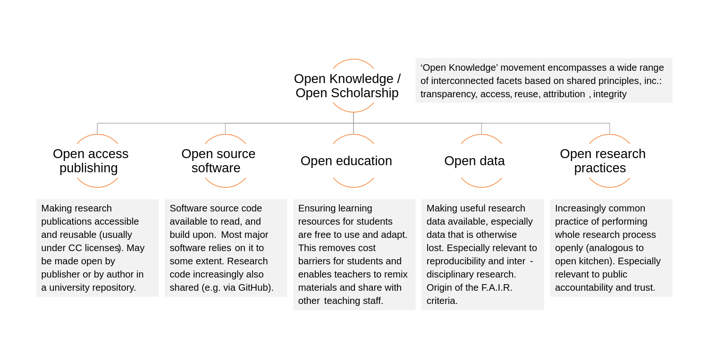

رغم اهتمامنا بالقضايا المتعلقة بالبرمجيات مفتوحة المصدر، إلا أن مفهوم «الانفتاح» يشمل مجالات أوسع من مجال البرمجيات. إن الحركات التي تطالب بالعلم المفتوح، البيانات المفتوحة، البحث العلمي المفتوح، والوصول المفتوح كلها بنفس أهمية حركة البرمجيات مفتوحة المصدر، وذلك لمن تهمه مسائل الحرية والشفافية والجودة. يشمل مصطلح «المعرفة المفتوحة» كل من هذه المفاهيم، وغيرها.

ونظرًا لكونه مفهومًا بهذا الشمول، يصعب كتابة مقال واحد يكفي لتغطية جميع أبعاده. مع ذلك، نأمل أن تكون محاولتنا هذه نقطة بداية تدفع القارئ المهتم لدراسة هذا الموضوع والبحث فيه بشكل أعمق.

عند الحديث عن المعرفة المفتوحة، يجب التطرق إلى مفهوم «الانفتاح» نفسه، كونه مفهومًا جوهريًا لهذا المصطلح. قدمت [مؤسسة المعرفة المفتوحة](https://okfn.org) تعريفًا لهذا المفهوم في ملف تحت اسم [«تعريف الانفتاح»](https://opendefinition.org)، وهو تعريف شبيه بـ[تعريف المصدر المفتوح](https://opensource.org/osd)، ولخصت المؤسسة التعريف بهذه العبارة:

> المحتوى المفتوح هو كل ما يمكن الوصول إليه واستخدامه وتعديله ونشره بشكل حر ولأي غرض (والتي قد تكون عرضة ً لشروط تضمن، كحد أقصى، بقاءه مفتوحًا أو ذكر المؤلف).

مع أن مصطلح "معرفة مفتوحة" يعد جديدًا نسبيًا، إلا أن المفاهيم التي يحملها ليست بالشيء الجديد. وأحد أقدم الأمثلة الموجودة الآن تعود لنص بوذي قديم صدر في الصين عام 868، وأشار الكاتب فيه إلى حرية توزيع هذا النص، وبذلك جعله متوفرًا لعامة الناس. وهناك أيضًا الموسوعة الفرنسية لعام 1772 للكاتب دينيس ديدرو الذي سمح بإعادة استخدام عمله كونه استخدم أعمال الآخرين لتأليف عمله.

أحد مجالات المعرفة المفتوحة هو _**البحث العلمي المفتوح**_، الذي يسمح ﻷي فرد بالوصول ﻷحدث وأهم
الأبحاث العلمية ويسمح للباحثين بالتعاون والعمل معًا. أحد المنصات التي تسمح بالوصول المفتوح للأبحاث العلمية هي [Arxiv](https://arxiv.org) التي تحتوي على أبحاث علمية في مختلف المجالات. ومع أن بعض المنصات تقيد الوصول المفتوح للأبحاث العلمية، مثل [JSTOR](https://www.jstor.org/)، فهي مع ذلك تسمح بالوصول المفتوح لبعض أبحاثها. بالرغم من ذلك، ما تزال هناك قضايا في هذا المجال يدعوا لها داعمو حركة البحث العلمي المفتوح لكنها لا تطبق، كأن ينشر الباحثون عملية بحثهم مثل الفرضيات الخاطئة التي يتوصلون إليها قبل أن يصلوا إلى النتيجة النهائية والبرمجيات المستخدمة للقيام بالبحث، إضافةً لنشر المجلات أسماء من يعملون على مراجعة الأبحاث العلمية.

من المجالات المهمة المتعلقة بالمعرفة المفتوحة هي _**المصادر التعليمية المفتوحة**_. تُعرِّف منظمة UNESCO المصادر التعليمية المفتوحة على أنها:
> المواد التعليمية والبحثية التي توظف أدوات مناسبة، كالرخص المفتوحة، للسماح للآخرين باستخدام هذه المواد وتطويرها واستعمالها بمختلف الطرق بشكل حر لأغراض تعليمية.

تشمل المصادر التعليمية المفتوحة الكتب التعليمية المفتوحة، الدورات المفتوحة، المواد التدريسية المفتوحة، الفيديوهات التعليمية المفتوحة، الاختبارات المفتوحة، والبرمجيات مفتوحة المصدر. تسمح هذه المصادر لأي شخص بالتمتع بخمس ميزات:
* الحق في نسخ المحتوى التعليمي.
* الحق في استخدام المحتوى في مختلف السياقات (كأن يُستخدم في الصف أو للدراسة الشخصية).
* الحق في تعديل المحتوى نفسه.
* الحق في استخدام المحتوى بالإضافة لمواد أخرى لإنشاء محتوى جديد.
* الحق في نشر نسخ من المحتوى، حتى إن كانت معدلة.

هناك العديد من المؤسسات التي تسهم في نشر المصادر التعليمية المفتوحة، مثل MIT ومشروعها [OpenCourseWare](https://ocw.mit.edu/) الذي يوفر ما يزيد عن الـ2400 مساق بشكل مفتوح للجميع، إضافةً إلى عمل مختلف الجامعات، مثل جامعتي ستانفورد وهارفارد، على توفير بعض مساقاتهم بشكل مفتوح. كذلك يوفر العديد من المعلمين محاضراتهم بشكل مفتوح على الإنترنت.
بالنسبة للكتب التعليمية المفتوحة، يوفر بعض المؤلفين كتبهم للعامة. نذكر من هذه الكتب:
* [Operating Systems: Three Easy Pieces](https://pages.cs.wisc.edu/~remzi/OSTEP/)
* [The Linux Command Line](https://www.linuxcommand.org/tlcl.php)
* [Automating the Boring Stuff with Python](https://automatetheboringstuff.com)
* [Speech and Language Processing](https://web.stanford.edu/~jurafsky/slp3/)

كذلك توفر بعض المواقع الإلكترونية مجموعات من الكتب التعليمية المفتوحة، مثل [Open Textbook Library](https://open.umn.edu/opentextbooks/) المدعومة من جامعة منيسوتا والتي توفر مكتبة كبيرة من الكتب في مختلف المجالات كالطب والقانون وتكنولوجيا المعلومات؛ وأيضًا [LibreTextx Mathematics](https://math.libretexts.org/) التي تقدم قائمة من كتب الرياضيات المفتوحة.

في الختام،نذكر بأن مفهوما المعرفة المفتوحة والانفتاح واسعان ولم نذكر عنهما سوى القليل هنا. لذلك نوصي المهتمين في هذا الموضوع بالقيام بمزيد من البحث والمطالعة وأن يساعدوا في هذا المجال بنشر ما ينتجونه من معرفة بشكل مفتوح للعامة، أملًا في المساهمة في نشر المعرفة المفتوحة

**ننصح بقراءة:**
* [The Case For Free Online Books](https://from-a-to-remzi.blogspot.com/2014/01/the-case-for-free-online-books-fobs.html)
